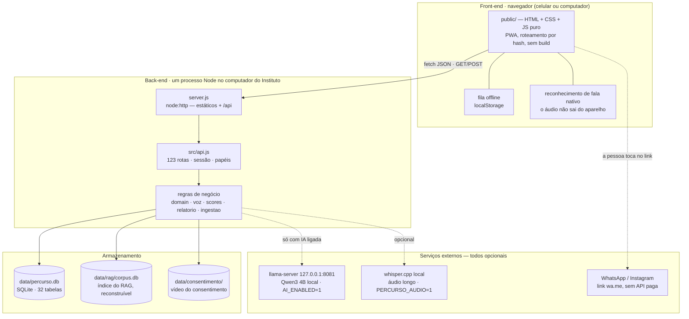

# Handover — Percurso

**Entrega da Semana 10 · Módulo 3 · Trilha de Tecnologia · MVP Funcional**
Instituto Ebenézer · Desafio B (monitoramento de impacto) · Grupo 06

> **Para quem é este documento.** Para a coordenação do Instituto Ebenézer operar o Percurso
> **sem os autores**, e para quem avalia a entrega encontrar, num lugar só, os cinco itens que o
> guia pede: vídeo demonstrativo, modelo de dados, instalação e acesso, evidências de teste e
> decisões técnicas. Cada seção resume e aponta para o documento detalhado — este arquivo é a
> porta de entrada, não a enciclopédia.

| | |
|---|---|
| **Repositório** | https://github.com/igorregoir-lgtm/percurso-mvp (público) |
| **Vídeo demonstrativo** | `video/percurso-demonstracao.mp4` — §8 |
| **Protótipo Figma (canônico)** | https://www.figma.com/design/h6AnLVYLfpeVl2N4ie0Qzv |
| **Dados** | 100% sintéticos — nenhum dado real de criança foi usado em nenhuma etapa |
| **Custo de operação** | R$ 0 de licença, R$ 0 de API, sem mensalidade, sem conta em plataforma |

---

## 1. O que é, em uma página

O Instituto acompanha cerca de 120 matrículas em quatro programas, com duas pessoas fixas e
voluntários de sábado, e **não tinha registro**: presença em planilha, evolução socioemocional na
memória de quem atende, relatório para doador montado à mão. O Percurso transforma **os minutos
que a educadora já tem** em indicador de programa:

- **Educadora / psicóloga** (celular): faz a chamada da turma num toque, registra a folha do dia
  (por voz ou por botões), observa cada criança pela rubrica das **seis dimensões da planilha
  socioemocional do Instituto** — duas a três vezes por ano, não toda semana.
- **Coordenação** (computador): vê presença, cobertura do registro, alertas de ausência (duas
  faltas seguidas), régua de 75%, consentimentos pendentes e a síntese do ciclo para aprovar.
- **Diretoria**: monta o relatório do ciclo para quem financia — agregado, sem nome de criança,
  com supressão de grupos pequenos (n < 5) e revisão humana obrigatória antes de sair.

**O que o Percurso não faz, por desenho:** não guarda conteúdo clínico (o filtro de perímetro
recusa antes de gravar), não dá nota à criança (nenhum score pontua a criança), não deixa a
diretoria abrir ficha individual, não manda nada para nuvem de terceiro e não depende de IA —
a camada de IA é opcional e vem desligada.

---

## 2. Instalação e acesso

Detalhe passo a passo, com Windows e macOS: [`MANUAL-DE-INSTALACAO.md`](MANUAL-DE-INSTALACAO.md).

**Requisito único:** Node.js **22.13 ou mais novo** (recomendado o 24 LTS de
[nodejs.org](https://nodejs.org), instalador padrão). Não há `npm install`, build nem conta.

```bash
git clone https://github.com/igorregoir-lgtm/percurso-mvp.git   # ou copiar a pasta por pen drive
cd percurso-mvp
node server.js
```

Abra **http://localhost:3000**. Na primeira execução o banco é criado e populado sozinho com os
dados sintéticos. Para voltar ao estado de demonstração a qualquer momento:
`node scripts/reset.mjs` (pode rodar com o servidor no ar; depois, recarregue a página).

**Entrar** é escolher quem está usando (não há senha — decisão 51; a sessão usa token opaco):

| Perfil de demonstração | Papel | O que vê |
|---|---|---|
| **Maria Silvia** | educadora (Reforço · Tarde A) | Hoje, chamada, folha do dia, observação |
| **Carolina Duarte** | psicóloga (Vivência) | Vivência, registro de vivência, relato |
| **Rita Amaral** | coordenação | Painel, consentimentos, cadastro, síntese |
| **Solange Ribeiro** | diretoria | Relatório do ciclo, Impacto (SROI exploratório), divulgação |

**No celular dos educadores**, a captura de voz exige HTTPS (regra do navegador):
`node scripts/gerar-certificado.mjs && PERCURSO_HTTPS=1 node server.js`, e o celular abre o
endereço da máquina na rede do Instituto. O aviso de "conexão não privada" na primeira visita é
esperado. Sem HTTPS, tudo funciona por botões — só a voz fica de fora.

---

## 3. O fluxo principal — o que testar em cinco minutos

Nenhum passo abaixo depende de voz (o pedido da aula de 30/09 foi exatamente esse recorte).

1. **Maria → Hoje.** Banner de retomada (*"Que bom te ver de volta…"*) e as datas de chamada em
   aberto — nada expira, registrar atrasado não tem penalidade.
2. **Chamada.** "Todos presentes", desmarcar duas faltas, salvar. A data sai das pendentes e a
   próxima abre sozinha.
3. **Observação.** Abrir uma criança da agenda do ciclo, marcar as seis dimensões (âncoras de 1 a
   4). Tentar escrever um diagnóstico no campo → o filtro de perímetro isola o trecho e oferece
   salvar sem ele.
4. **Rita → Painel.** Crianças únicas × matrículas, presença, cobertura, alertas e safras;
   **Consentimentos**: registrar um responsável desbloqueia a criança para observação.
5. **Solange → Relatório.** Gerar o relatório do ciclo: sete blocos, nenhum nome, ressalva
   metodológica e supressão declaradas; publicar só depois do revisor.

O roteiro completo de validação com usuário, com tarefas cronometradas, está em
[`VALIDACAO-USUARIO.md`](VALIDACAO-USUARIO.md).

---

## 4. Arquitetura

Quatro camadas num único processo, um arquivo de banco, nenhum serviço externo obrigatório.
Detalhe, invariantes e horizontes: [`ARQUITETURA.md`](ARQUITETURA.md).



**Por que assim** (decisão 1): o dossiê manda tratar mensalidade de plataforma como risco e diz
que não há equipe de tecnologia. No-code resolveria a semana 10 e falharia na 11 — licença
recorrente e dado de criança em nuvem de terceiro. Node puro + SQLite em arquivo é **uma coisa
instalada, zero dependência que quebre com atualização, backup por cópia de arquivo**.

---

## 5. Modelo de dados

**32 tabelas, 49 chaves estrangeiras**, SQLite com `foreign_keys = ON`. O diagrama
entidade-relacionamento é **gerado do esquema real** — `npm run docs:er` reescreve
[`MODELO-DE-DADOS-ER.md`](MODELO-DE-DADOS-ER.md) (núcleo de 15 tabelas + esquema completo, com
colunas e volume semeado). O porquê de cada entidade e as regras que o esquema carrega estão em
[`MODELO-DE-DADOS.md`](MODELO-DE-DADOS.md).

Três decisões de modelagem que sustentam o produto:

1. **Criança ≠ matrícula.** A soma "60 + 40 + 20 = 120" do dossiê mistura as duas coisas: uma
   criança pode estar em dois programas. O indicador conta crianças únicas; a operação, matrículas.
2. **Campo sem governança não existe.** Todo dado pessoal passa por `governanca_campo` (base
   legal, titular, acesso, retenção). `consentimento` tem chave estrangeira para ela: o campo sem
   as quatro respostas é **impossível de gravar**, não só proibido.
3. **A folha pendura no encontro, não na criança.** Não existe coluna em `folha` que aponte para
   `crianca` — "o que cada criança fez não entra aqui, esta folha é da turma" virou esquema.

**Dados sintéticos** (`src/seed.js`, semente fixa e determinística): quatro programas, sete turmas,
cinco pessoas na equipe, 132 crianças em 170 matrículas, dois ciclos de observação, cerca de 4 mil
presenças e mil itens de observação — o suficiente para todo painel
ter o que mostrar. A troca por dado real é um evento de governança (consentimento dos
responsáveis), não um deploy.

---

## 6. Evidências de teste

Execução completa de **05/10/2026**, com saída e tabelas em
[`EVIDENCIAS-SEMANA-10.md`](EVIDENCIAS-SEMANA-10.md); o que cada bateria cobre, bloco a bloco,
em [`TESTES.md`](TESTES.md).

| Bateria | Comando | Resultado | O que prova |
|---|---|---|---|
| Fluxo principal (API) | `node scripts/reset.mjs && npm test` | **515 / 515** | os fluxos dos quatro papéis, ponta a ponta, contra o servidor no ar |
| Regras de domínio | `npm run test:unit` | **224 / 224** | regras críticas sem servidor, em banco temporário |
| Persistência após reiniciar | `npm run test:persistencia` | **9 / 9** | grava, derruba o servidor, sobe outro e relê — o dado está no disco |
| Quebra (entrada inválida) | `npm run test:quebra` | **17 / 17** | campo em branco, número negativo, item inexistente, injeção, JSON quebrado |
| Camada de IA sem modelo | `npm run test:ia` | **24 / 24** | as coleiras do copilot e o fallback quando o modelo cai |
| Áudio sem modelo | `npm run test:audio` | **19 / 19** | o ciclo de vida do áudio: nada sobrevive à transcrição |
| RAG | `npm run test:rag` | **6 / 6** | citações existentes, cobertura pt-BR, consulta pseudonimizada |

Todas, exceto o fluxo principal, sobem servidor e banco próprios e **nunca tocam
`data/percurso.db`**. O CI (`.github/workflows/ci.yml`) roda as baterias a cada push.

### 6.1 O teste de quebra encontrou defeitos — e eles foram corrigidos

O teste de quebra foi escrito nesta entrega seguindo o formato da aula (situação inicial →
entrada → esperado → obtido) e **achou quatro defeitos na primeira execução**:

| Entrada | Antes | Depois |
|---|---|---|
| chamada com data impossível (`2026-02-31`) | **200** — gravava um encontro num dia que não existe | **422** — "A data da chamada não existe no calendário." |
| lista de crianças com filtro `?turma_id=abc` | **200** — o filtro sumia em silêncio e voltavam todas as turmas | **422** — "Parâmetro inválido: turma_id." |
| chamada com tempo de registro negativo (`-30 s`) | **200** — virava "1 segundo" na métrica de custo de tempo | **200** — a chamada salva e o tempo inválido é descartado (vazio): medição que falha não derruba o registro |
| chamada com data em branco | **200** — assume hoje | **mantido**: é o padrão da rota (GET e POST), não defeito |

O teste de persistência também foi **provado sensível**: rodado com o banco em memória (que
morre com o processo), as quatro asserções de releitura falham. Um teste que nunca falha não
prova nada.

---

## 7. Decisões técnicas principais

São 51 decisões registradas, cada uma com contexto, alternativas e consequência, em
[`DECISOES-TECNICAS.md`](DECISOES-TECNICAS.md). As que definem o produto:

| # | Decisão | Em uma linha |
|---|---|---|
| 1 | Node puro + SQLite, zero dependência | Uma coisa instalada; nada quebra com atualização de terceiro; R$ 0 |
| 4 | O escore nunca nasce de modelo | Número vem da rubrica e da fórmula; IA só filtra, redige em template ou revisa |
| 5 | Filtro de perímetro determinístico | Conteúdo clínico é recusado **antes** de qualquer gravação, com encaminhamento humano |
| 6 | Consentimento é chave estrangeira | Sem consentimento, a observação é impossível no banco, não só na tela |
| 16 | A diretoria não abre registro individual | Ela vê agregado; nome de criança nunca chega ao relatório |
| 17 | Fila offline no aparelho | Falha de rede vira fila; nunca perda de registro |
| 19 | IA local, opt-in, com fallback em tudo | `AI_ENABLED` desligada = o produto inteiro funciona igual |
| 30 | Ninguém é apagado | Quem sai vai para o arquivo; histórico e presença ficam |
| 34 | A rubrica fala a língua da planilha do Instituto | Seis indicadores da planilha socioemocional; mapeamento 1–4 → 0–2 declarado |
| 51 | Sem senha, com token opaco | Entrar é escolher quem usa; a sessão é revogável e o cookie não é o id |

**Desvio declarado do material de aula:** o slide de arquitetura previa no-code (Airtable +
formulários). O Percurso usa código próprio — a justificativa está na decisão 1 e em
[`ARQUITETURA.md`](ARQUITETURA.md) §1.

---

## 8. Vídeo demonstrativo

`video/percurso-demonstracao.mp4` — **7m19s, 18 cenas, os quatro papéis**, gravado em 05/10/2026
sobre o roteiro v3 ([`ROTEIRO-DO-VIDEO.md`](ROTEIRO-DO-VIDEO.md)): educadora, psicóloga (com a
captura por voz, o filtro de perímetro, o relato e o recado), coordenação, diretoria e a camada de
IA local, terminando nos números dos testes. Gerado sem gravação de tela: um Chrome headless
isolado é pilotado pelo roteiro em `video/gravar.mjs`, e a narração aparece como legenda. Para regerar
depois de qualquer mudança de tela: [`video/README.md`](../video/README.md).

---

## 9. Operação depois da entrega — quem, quanto tempo, que competência

O bloco 5 do dossiê diz que não há profissional de tecnologia. A operação foi desenhada para três
papéis, nenhum técnico. **Os tempos são estimativa do grupo, a medir no piloto.**

| Papel | Quem (proposta) | O que faz | Tempo estimado | Competência |
|---|---|---|---|---|
| Responsável pela máquina | alguém da coordenação ou do administrativo | liga o computador (o Percurso sobe sozinho — manual §5); copia o backup | ~5 min/semana | copiar um arquivo para pen drive |
| Coordenação | a coordenação do Instituto, dona do Percurso | consentimentos, cadastro de pessoas e turmas, aprovação da síntese | dentro da rotina atual | usar navegador |
| Educadoras e psicóloga | equipe e voluntários | chamada, folha do dia, observação no ciclo | ~2 min por encontro (chamada) | usar celular |

**Rotina de backup** (o único cuidado recorrente): o banco inteiro é `data/percurso.db`. Com o
servidor parado, copie o arquivo; ligado, copie junto `percurso.db-wal` e `percurso.db-shm`.
Restaurar é copiar de volta **apagando antes `-wal` e `-shm` antigos** — copiar o backup por cima
de um `-wal` velho mistura dois estados do banco.

**Quando algo der errado:** [`MANUAL-DE-INSTALACAO.md`](MANUAL-DE-INSTALACAO.md), seção
"Resolução de problemas" (Node não instalado, servidor parado, IA desligada). Para voltar ao
estado de demonstração: `node scripts/reset.mjs`.

**A camada de IA** (copilot reflexivo, RAG com fontes citadas, explicação de premissas do SROI)
é opcional: exige um computador com 8 GB de RAM livres e o download de ~2,5 GB do modelo
(`ai/scripts/setup-model.sh`). Os notebooks doados ao Instituto são os candidatos — ainda não
avaliados. Se ninguém ligar o modelo, nada quebra.

---

## 10. O que não está pronto — dito com todas as letras

- **Validação com usuário real do Instituto.** O protocolo está pronto
  ([`VALIDACAO-USUARIO.md`](VALIDACAO-USUARIO.md)); a sessão com a psicóloga não aconteceu.
- **Dado real.** O produto opera só com dado sintético. Trocar exige, antes: **senha por pessoa**
  (a decisão 51 tirou a senha para a demonstração; o desenho da 39 volta), consentimento dos
  responsáveis com termo arquivado, backup automatizado e **migração incremental do esquema** (hoje
  o banco se recria quando o esquema muda — aceitável só com dado sintético; decisão 14). A lista
  completa é o Horizonte 2 de [`ARQUITETURA.md`](ARQUITETURA.md) §5.
- **Modelo de relatório do conselho.** O template do relato é provisório até a psicóloga enviar o
  modelo prometido na visita.
- **Números financeiros do Instituto.** O business case (trilha de Negócios) depende de receita,
  orçamento 2026 e base de doadores que ainda não foram enviados.

A lista viva, com o que depende de quem: [`PENDENCIAS-DE-ENTREGA.md`](PENDENCIAS-DE-ENTREGA.md).

---

## 11. Mapa da documentação

| Quero… | Documento |
|---|---|
| instalar e operar | [`MANUAL-DE-INSTALACAO.md`](MANUAL-DE-INSTALACAO.md) |
| entender a arquitetura | [`ARQUITETURA.md`](ARQUITETURA.md) |
| ver o modelo de dados | [`MODELO-DE-DADOS-ER.md`](MODELO-DE-DADOS-ER.md) · [`MODELO-DE-DADOS.md`](MODELO-DE-DADOS.md) |
| ver as evidências de teste | [`EVIDENCIAS-SEMANA-10.md`](EVIDENCIAS-SEMANA-10.md) · [`TESTES.md`](TESTES.md) |
| saber por que algo é assim | [`DECISOES-TECNICAS.md`](DECISOES-TECNICAS.md) |
| conduzir um teste com usuário | [`VALIDACAO-USUARIO.md`](VALIDACAO-USUARIO.md) |
| ligar a IA local | [`../ai/README.md`](../ai/README.md) |
| saber o que falta | [`PENDENCIAS-DE-ENTREGA.md`](PENDENCIAS-DE-ENTREGA.md) |
