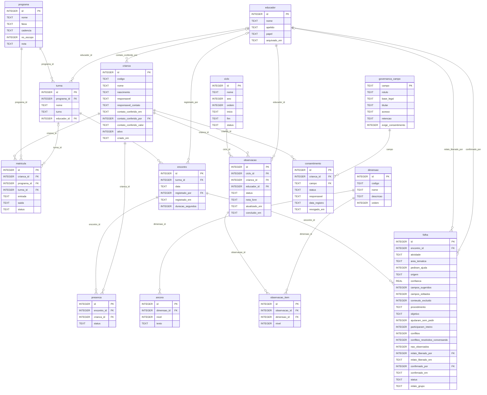

# Modelo de dados — diagrama entidade-relacionamento

> **Gerado automaticamente** por `node scripts/gerar-diagrama-er.mjs` a partir do esquema real
> (`src/db.js`, versão legível 2). Não edite à mão: rode o script de novo quando o
> esquema mudar. O porquê de cada entidade e as regras que o esquema carrega estão em
> [`MODELO-DE-DADOS.md`](MODELO-DE-DADOS.md).

**32 tabelas · 49 chaves estrangeiras.** Banco: SQLite embutido do Node
(`node:sqlite`), um arquivo só em `data/percurso.db`, com `foreign_keys = ON`.

Leitura dos diagramas: `pai ||--o{ filha` = uma linha do pai tem zero ou muitas na filha, e a
FK da filha é obrigatória; `o|--o{` = a FK pode ficar vazia. O rótulo da linha é a coluna da FK.

## Núcleo — as 15 tabelas do fluxo principal

Chamada da turma (`encontro` + `presenca`), observação pela rubrica (`observacao` +
`observacao_item`, com `dimensao` e `ancora`), bloqueio por consentimento (`consentimento` →
`governanca_campo`) e a folha do dia (`folha`, pendurada no encontro, nunca na criança).
**Criança ≠ matrícula:** uma criança pode estar em dois programas; o indicador conta crianças
únicas.

## Esquema completo — 32 tabelas

```mermaid
erDiagram
  crianca ||--o{ acesso_individual : "crianca_id"
  educador ||--o{ acesso_individual : "educador_id"
  crianca ||--o{ alerta : "crianca_id"
  dimensao ||--o{ ancora : "dimensao_id"
  crianca ||--o{ aspiracao : "crianca_id"
  educador ||--o{ atividade : "educador_id"
  turma ||--o{ atividade_area : "turma_id"
  educador o|--o{ calendario_excecao : "criado_por"
  turma ||--o{ calendario_excecao : "turma_id"
  turma o|--o{ canal : "turma_id"
  governanca_campo ||--o{ consentimento : "campo"
  crianca ||--o{ consentimento : "crianca_id"
  educador ||--o{ consentimento_evidencia : "registrado_por"
  governanca_campo ||--o{ consentimento_evidencia : "campo"
  crianca ||--o{ consentimento_evidencia : "crianca_id"
  educador o|--o{ crianca : "contato_conferido_por"
  educador ||--o{ disparo : "por"
  canal ||--o{ disparo : "canal_id"
  educador o|--o{ encontro : "registrado_por"
  turma ||--o{ encontro : "turma_id"
  educador ||--o{ folha : "confirmado_por"
  educador o|--o{ folha : "relato_liberado_por"
  encontro ||--o{ folha : "encontro_id"
  folha ||--o{ folha_marcador : "folha_id"
  educador o|--o{ importacao : "executado_por"
  turma o|--o{ matricula : "turma_id"
  programa ||--o{ matricula : "programa_id"
  crianca ||--o{ matricula : "crianca_id"
  educador ||--o{ observacao : "educador_id"
  crianca ||--o{ observacao : "crianca_id"
  ciclo ||--o{ observacao : "ciclo_id"
  dimensao ||--o{ observacao_item : "dimensao_id"
  observacao ||--o{ observacao_item : "observacao_id"
  educador o|--o{ parecer : "liberado_por"
  educador ||--o{ parecer : "gerado_por"
  crianca ||--o{ parecer : "crianca_id"
  educador o|--o{ pauta : "decidido_por"
  turma ||--o{ pauta : "turma_id"
  crianca ||--o{ presenca : "crianca_id"
  encontro ||--o{ presenca : "encontro_id"
  ciclo o|--o{ relato_crianca : "ciclo_id"
  educador ||--o{ relato_crianca : "educador_id"
  crianca ||--o{ relato_crianca : "crianca_id"
  educador o|--o{ relatorio : "publicado_por"
  educador o|--o{ sintese : "aprovado_por"
  programa o|--o{ sintese : "programa_id"
  ciclo ||--o{ sintese : "ciclo_id"
  educador o|--o{ turma : "educador_id"
  programa ||--o{ turma : "programa_id"
  acesso_individual {
    INTEGER id PK
    INTEGER educador_id FK
    TEXT papel
    TEXT recurso
    INTEGER crianca_id FK
    TEXT em
  }
  alerta {
    INTEGER id PK
    INTEGER crianca_id FK
    TEXT tipo
    TEXT detalhe
    TEXT criado_em
    TEXT status
    TEXT tratativa
    TEXT atualizado_em
  }
  ancora {
    INTEGER id PK
    INTEGER dimensao_id FK
    INTEGER nivel
    TEXT texto
  }
  aspiracao {
    INTEGER id PK
    INTEGER crianca_id FK
    TEXT area
    TEXT declarada_em
  }
  atividade {
    INTEGER id PK
    INTEGER educador_id FK
    TEXT data
    TEXT tipo
  }
  atividade_area {
    INTEGER id PK
    INTEGER turma_id FK
    TEXT area
    TEXT data
    TEXT origem
  }
  calendario_excecao {
    INTEGER id PK
    INTEGER turma_id FK
    TEXT data
    TEXT tipo
    TEXT motivo
    INTEGER criado_por FK
    TEXT criado_em
  }
  canal {
    INTEGER id PK
    TEXT tipo
    TEXT nome
    TEXT publico
    INTEGER turma_id FK
    TEXT destino
    TEXT observacao
    INTEGER ativo
    TEXT criado_em
  }
  ciclo {
    INTEGER id PK
    TEXT nome
    INTEGER ano
    INTEGER ordem
    TEXT inicio
    TEXT fim
    TEXT status
  }
  consentimento {
    INTEGER id PK
    INTEGER crianca_id FK
    TEXT campo FK
    TEXT status
    TEXT responsavel
    TEXT data_registro
    TEXT revogado_em
  }
  consentimento_evidencia {
    INTEGER id PK
    INTEGER crianca_id FK
    TEXT campo FK
    TEXT arquivo
    TEXT mime
    INTEGER bytes
    INTEGER duracao_s
    TEXT responsavel
    INTEGER registrado_por FK
    TEXT criado_em
    TEXT expira_em
  }
  crianca {
    INTEGER id PK
    TEXT codigo
    TEXT nome
    TEXT nascimento
    TEXT responsavel
    TEXT responsavel_contato
    TEXT contato_conferido_em
    INTEGER contato_conferido_por FK
    TEXT contato_conferido_valor
    INTEGER ativo
    TEXT criado_em
  }
  dimensao {
    INTEGER id PK
    TEXT codigo
    TEXT nome
    TEXT descricao
    INTEGER ordem
  }
  disparo {
    INTEGER id PK
    INTEGER canal_id FK
    TEXT conteudo
    TEXT referencia
    INTEGER por FK
    TEXT em
  }
  educador {
    INTEGER id PK
    TEXT nome
    TEXT apelido
    TEXT papel
    TEXT arquivado_em
  }
  encontro {
    INTEGER id PK
    INTEGER turma_id FK
    TEXT data
    INTEGER registrado_por FK
    TEXT registrado_em
    INTEGER duracao_segundos
  }
  folha {
    INTEGER id PK
    INTEGER encontro_id FK
    TEXT atividade
    TEXT area_tematica
    INTEGER pediram_ajuda
    TEXT origem
    REAL confianca
    INTEGER campos_sugeridos
    INTEGER campos_editados
    INTEGER conteudo_excluido
    TEXT procedimento
    TEXT objetivo
    INTEGER ajudaram_sem_pedir
    INTEGER participaram_inteiro
    INTEGER conflitos
    INTEGER conflitos_resolvidos_conversando
    INTEGER nao_observados
    INTEGER relato_liberado_por FK
    TEXT relato_liberado_em
    INTEGER confirmado_por FK
    TEXT confirmado_em
    TEXT status
    TEXT relato_grupo
  }
  folha_marcador {
    INTEGER id PK
    INTEGER folha_id FK
    TEXT marcador
  }
  governanca_campo {
    TEXT campo PK
    TEXT rotulo
    TEXT base_legal
    TEXT titular
    TEXT acesso
    TEXT retencao
    INTEGER exige_consentimento
  }
  importacao {
    INTEGER id PK
    TEXT origem
    INTEGER linhas
    INTEGER criancas_novas
    INTEGER reconhecidas
    INTEGER duplicatas
    INTEGER encontros
    INTEGER presencas
    INTEGER descartadas
    TEXT relatorio_json
    INTEGER executado_por FK
    TEXT executado_em
  }
  matricula {
    INTEGER id PK
    INTEGER crianca_id FK
    INTEGER programa_id FK
    INTEGER turma_id FK
    TEXT entrada
    TEXT saida
    TEXT status
  }
  observacao {
    INTEGER id PK
    INTEGER ciclo_id FK
    INTEGER crianca_id FK
    INTEGER educador_id FK
    TEXT status
    TEXT nota_livre
    TEXT atualizado_em
    TEXT concluido_em
  }
  observacao_item {
    INTEGER id PK
    INTEGER observacao_id FK
    INTEGER dimensao_id FK
    INTEGER nivel
  }
  parecer {
    INTEGER id PK
    INTEGER crianca_id FK
    TEXT destinatario
    TEXT texto
    TEXT numeros_json
    TEXT revisor_status
    TEXT status
    INTEGER gerado_por FK
    TEXT gerado_em
    INTEGER liberado_por FK
    TEXT liberado_em
  }
  pauta {
    INTEGER id PK
    INTEGER turma_id FK
    TEXT semana
    TEXT sugestao_codigo
    TEXT sugestao_titulo
    TEXT decisao
    INTEGER decidido_por FK
    TEXT decidido_em
  }
  presenca {
    INTEGER id PK
    INTEGER encontro_id FK
    INTEGER crianca_id FK
    TEXT status
  }
  programa {
    INTEGER id PK
    TEXT nome
    TEXT faixa
    TEXT cadencia
    INTEGER no_escopo
    TEXT nota
  }
  relato_crianca {
    INTEGER id PK
    INTEGER crianca_id FK
    INTEGER educador_id FK
    INTEGER ciclo_id FK
    TEXT texto
    TEXT criado_em
  }
  relatorio {
    INTEGER id PK
    TEXT tipo
    TEXT periodo
    TEXT periodo_inicio
    TEXT periodo_fim
    TEXT blocos_json
    TEXT texto
    TEXT revisor_status
    TEXT revisor_notas
    TEXT supressoes_json
    TEXT status
    TEXT gerado_em
    INTEGER publicado_por FK
    TEXT publicado_em
  }
  sintese {
    INTEGER id PK
    INTEGER ciclo_id FK
    INTEGER programa_id FK
    TEXT texto
    TEXT numeros_json
    TEXT revisor_status
    TEXT revisor_notas
    TEXT status
    TEXT gerado_em
    INTEGER aprovado_por FK
    TEXT aprovado_em
  }
  transcricao_medida {
    INTEGER id PK
    INTEGER audio_s
    INTEGER ms
    TEXT modelo
    INTEGER threads
    TEXT criado_em
  }
  turma {
    INTEGER id PK
    INTEGER programa_id FK
    TEXT nome
    TEXT turno
    INTEGER educador_id FK
  }
```

## Tabelas, colunas e volume semeado

A última coluna é quantas linhas a semente sintética cria (`node scripts/reset.mjs`). Tabelas
com 0 nascem vazias e se enchem pelo uso.

| Tabela | Colunas | Chaves estrangeiras | Linhas na semente |
|---|---|---|---|
| `acesso_individual` | 6 | `crianca_id` → `crianca` `educador_id` → `educador` | 0 |
| `alerta` | 8 | `crianca_id` → `crianca` | 11 |
| `ancora` | 4 | `dimensao_id` → `dimensao` | 24 |
| `aspiracao` | 4 | `crianca_id` → `crianca` | 43 |
| `atividade` | 4 | `educador_id` → `educador` | 45 |
| `atividade_area` | 5 | `turma_id` → `turma` | 138 |
| `calendario_excecao` | 7 | `criado_por` → `educador` `turma_id` → `turma` | 0 |
| `canal` | 9 | `turma_id` → `turma` | 6 |
| `ciclo` | 7 | — | 2 |
| `consentimento` | 7 | `campo` → `governanca_campo` `crianca_id` → `crianca` | 318 |
| `consentimento_evidencia` | 11 | `registrado_por` → `educador` `campo` → `governanca_campo` `crianca_id` → `crianca` | 0 |
| `crianca` | 11 | `contato_conferido_por` → `educador` | 132 |
| `dimensao` | 5 | — | 6 |
| `disparo` | 6 | `por` → `educador` `canal_id` → `canal` | 0 |
| `educador` | 5 | — | 5 |
| `encontro` | 6 | `registrado_por` → `educador` `turma_id` → `turma` | 201 |
| `folha` | 23 | `confirmado_por` → `educador` `relato_liberado_por` → `educador` `encontro_id` → `encontro` | 164 |
| `folha_marcador` | 3 | `folha_id` → `folha` | 298 |
| `governanca_campo` | 7 | — | 17 |
| `importacao` | 12 | `executado_por` → `educador` | 0 |
| `matricula` | 7 | `turma_id` → `turma` `programa_id` → `programa` `crianca_id` → `crianca` | 170 |
| `observacao` | 8 | `educador_id` → `educador` `crianca_id` → `crianca` `ciclo_id` → `ciclo` | 175 |
| `observacao_item` | 4 | `dimensao_id` → `dimensao` `observacao_id` → `observacao` | 1047 |
| `parecer` | 11 | `liberado_por` → `educador` `gerado_por` → `educador` `crianca_id` → `crianca` | 0 |
| `pauta` | 8 | `decidido_por` → `educador` `turma_id` → `turma` | 16 |
| `presenca` | 4 | `crianca_id` → `crianca` `encontro_id` → `encontro` | 3952 |
| `programa` | 6 | — | 4 |
| `relato_crianca` | 6 | `ciclo_id` → `ciclo` `educador_id` → `educador` `crianca_id` → `crianca` | 0 |
| `relatorio` | 14 | `publicado_por` → `educador` | 0 |
| `sintese` | 11 | `aprovado_por` → `educador` `programa_id` → `programa` `ciclo_id` → `ciclo` | 0 |
| `transcricao_medida` | 6 | — | 0 |
| `turma` | 5 | `educador_id` → `educador` `programa_id` → `programa` | 7 |
